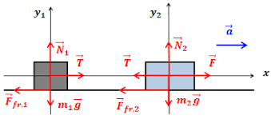

# Физика

## Движение связанных тел

При решении задач на движение связанных тел мы используем второй закон **Ньютона**. 

$$
F=ma
$$

Итак при описании движения связанных тел уравнение движения должно быть записано для каждого тела в отдельности, а действие тел друг на друга определяется *силой реакции опоры, натяжения нити и т. д*.

Ссылка на [GitHub](https://github.com)

